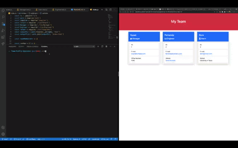

# Challenge 10: Team-Profile-Generator
-----------------------
## Table of Contents
- Introduction
- Description
- Installation
- Technologies used
- Demo
- Questions
- License

-----------------------
### Introduction
AS A manager
I WANT to generate a webpage that displays my team's basic info
SO THAT I have quick access to their emails and GitHub profiles

-----------------------
### Description
WHEN I start the application
THEN I am presented with a welcome message and a prompt to choose my first employee
WHEN I enter Manager
THEN I am prompted to enter the team manager’s name, employee ID, email address, and office number
WHEN I finish all prompts for the manager
THEN I am presented with a menu with the option to add an engineer or an intern or to complete my team
WHEN I select the engineer option
THEN I am prompted to enter the engineer’s name, ID, email, and GitHub username, and I am taken back to the menu
WHEN I select the intern option
THEN I am prompted to enter the intern’s name, ID, email, and school, and I am taken back to the menu
WHEN I decide to finish building my team
THEN I exit the application, and the HTML is generated

-----------------------
### Installation
To invoke application you will need to use command:

````
node index.js
````
-----------------------
### Technologies used
- Javascript
- Bootstrap
##### Dependecies needed for use:
- Jest
- Inquirer
- fs

-----------------------
### Demo


-----------------------
### Questions and Contact
E-mail: fernanda.frers@gmail.com
Github: balloonicorn92


-----------------------
#### License
[](http://unlicense.org/)
